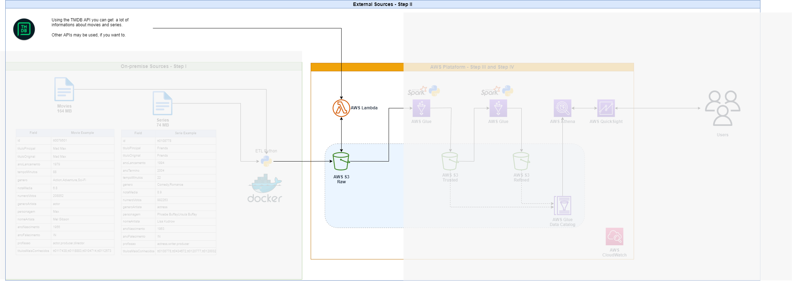
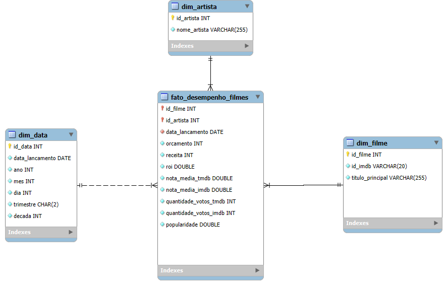
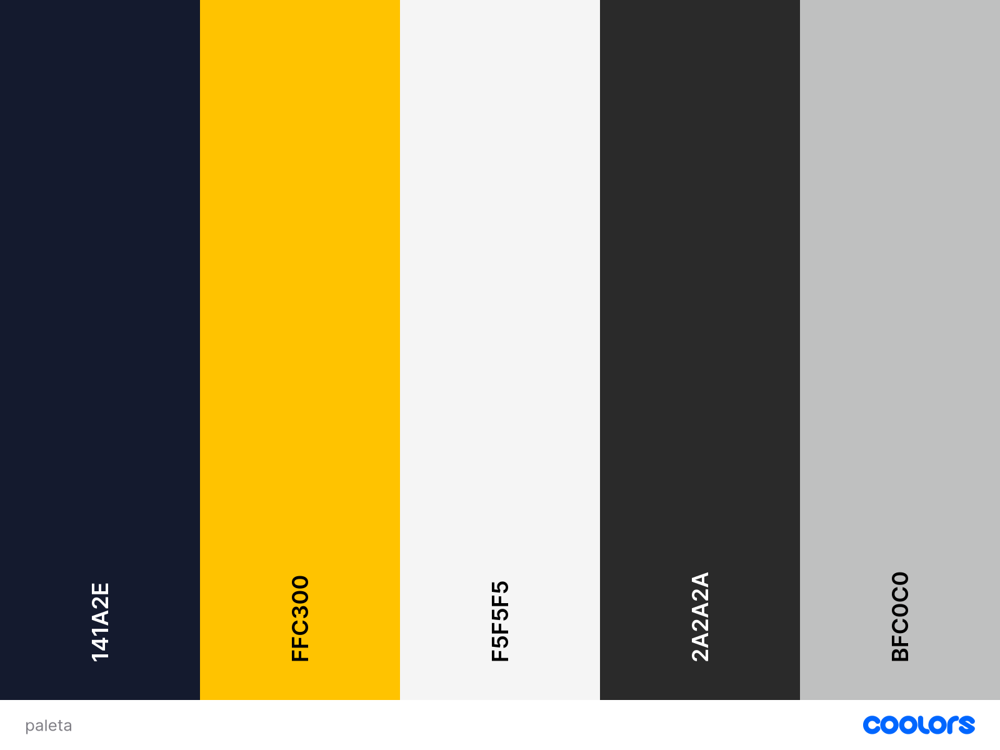
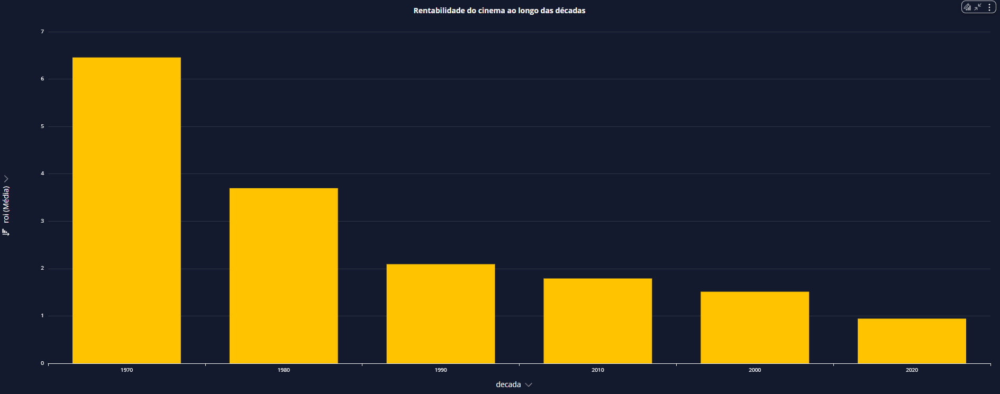

#  Projeto de Engenharia de Dados - Filmes & Séries  

##  Visão Geral  
Este projeto implementa um **pipeline de dados em nuvem** utilizando serviços da **AWS** para ingestão, transformação e análise de informações sobre **filmes e séries**.  

A solução integra fontes **on-premise** (arquivos CSV) e **APIs externas** (TMDB), processa os dados em múltiplas camadas no **S3** (Raw, Trusted e Refined), aplica transformações com **AWS Glue (PySpark)** e disponibiliza insights por meio do **AWS QuickSight**.  

 

---

##  Objetivos do Projeto  
- Criar um **pipeline completo** de dados usando boas práticas de Data Lake.  
- Integrar **dados on-premise (CSV)** com **APIs externas (TMDB)**.  
- Organizar os dados em **camadas (Raw, Trusted, Refined)**.  
- Processar e transformar os dados usando **AWS Glue + PySpark**.  
- Consultar e analisar os dados com **Athena**.  
- Disponibilizar insights visuais via **QuickSight**.  

---

##  Estrutura do Data Lake  

- **Raw Layer** → Armazena dados brutos, sem transformação.  
- **Trusted Layer** → Dados limpos e padronizados.  
- **Refined Layer** → Dados modelados e otimizados para análise.  

---

##  Tecnologias Utilizadas  

- **Linguagens & Ferramentas**: Python, PySpark, Docker  
- **Cloud AWS**:  
  - S3 (Raw, Trusted, Refined)  
  - Lambda (ingestão de dados + integração TMDB API)  
  - Glue (ETL e modelagem dimensional)  
  - Athena (consultas SQL sobre dados no S3)  
  - QuickSight (dashboards interativos)  
  - CloudWatch (monitoramento e logs)

---

##  Pipeline de Dados  

###  **Step I - On-premise Sources**  
- Base de **Filmes (164 MB)** e **Séries (74 MB)** em CSV.  
- Pré-processamento com **Python + Docker**.  
- Envio dos dados para o **S3 Raw**.  

 

### **Step II - External Sources**  
- Integração com a **TMDB API** para enriquecimento dos dados.  
- Coleta de atributos adicionais: popularidade, orçamento, receita, ROI, etc.

 

###  **Step III - AWS Platform (ETL)**  
- **AWS Lambda**: orquestra o envio e chamadas para APIs.  
- **AWS Glue (PySpark)**:  
  - Criação da **Trusted Layer** com dados limpos. 

###  **Step IV - AWS Platform (ETL)** 
  - Criação da **Refined Layer** com modelo dimensional.

###  **Step V - Analytics & Dashboards**  
- **AWS Glue Data Catalog**: catálogo de tabelas.  
- **Athena**: consultas SQL sobre o Data Lake.  
- **QuickSight**: dashboards para análise de ROI, notas, popularidade e tendências.

---

##  Modelagem Dimensional  

Na camada **Refined**, os dados foram organizados em modelo dimensional:  

- **Fato**: `fato_desempenho_filmes`  
- **Dimensões**:  
  - `dim_filme`  
  - `dim_artista`  
  - `dim_data` 

 

---

##  Análises Realizadas

##  Resultado Final

###  Paleta de Cores

###  Cabeçalho

#### **O Que Define o Sucesso no Cinema?**  
**Uma Análise de ROI, Receita e Popularidade**

---

###  KPIs Principais

- **Total de filmes:** `829`  
  A base é composta por 829 filmes, garantindo diversidade e robustez estatística.  

- **Total de artistas:** `1.758`  
  Representa a diversidade de atores, atrizes e profissionais envolvidos.  

- **Orçamento médio:** `US$ 35,65M`  
  Valor médio elevado, mas que esconde contrastes entre produções modestas e blockbusters.  

- **Receita média:** `US$ 91,14M`  
  Mostra que, em média, os filmes arrecadam mais que o triplo do investimento.  

- **ROI médio:** `2,03`  
  Cada US$ 1 investido gera em média US$ 2,03 de retorno.  

- **Popularidade média:** `5,08`  

- **Nota IMDb média:** `6,65`   

---

### 1️ ROI dos Filmes
  

Clássicos como *The Godfather* e *Pulp Fiction* multiplicaram seus investimentos mais de 25 vezes.  
*Halloween* surpreendeu com ROI altíssimo apesar de nota IMDb baixa.  
*Joker* provou que altos investimentos também podem gerar grande retorno, ultrapassando US$ 1 bilhão de receita.

---

### 2️ Relação entre Nota, Popularidade e ROI

O sucesso não depende de um único fator.  
- *The Godfather* e *Joker* → **bem avaliados, populares e rentáveis**.  
- *Baywatch* → **popularidade alta, mas prejuízo financeiro**.  
- *True Romance* → **nota boa, popularidade razoável, mas sem retorno**.  

Décadas de 70 e 80 aparecem como **era de ouro do ROI**, com produções enxutas e eficientes.

---

### 3️ Orçamento vs Receita

Filmes com altos orçamentos tendem a gerar mais receita, mas não há garantia.  
Diversos títulos caros fracassaram, enquanto filmes modestos alcançaram grande rentabilidade.

---

### 4️ Evolução ao Longo dos Anos

Tanto o orçamento quanto a receita cresceram ao longo das décadas.  
Porém, os custos sobem em ritmo maior que as receitas, reduzindo margens de lucro — especialmente nos anos 2010.

---

### 5️ ROI por Década

O ROI médio caiu fortemente ao longo das décadas.  
- 1970 → ROI médio acima de 6.  
- 2020 → ROI abaixo de 1.  

Isso mostra que o aumento dos custos superou o crescimento dos lucros.

---

### 6️ Sazonalidade dos Lançamentos

Meses de **maio, julho, novembro e dezembro** concentram ROI mais alto (férias e feriados).  
Meses como **janeiro, abril e agosto** têm desempenho abaixo da média.

---

### 7️ Artistas de Alto Desempenho
  

- **Altos ROI:** Tobin Bell, James Caan e Robert Redford.  
- **Recorrentes e rentáveis:** Al Pacino e Eddie Murphy.  
- **Mais populares:** Uma Thurman, James Caan e Frances McDormand.  

Esses nomes se destacam tanto pela **rentabilidade** quanto pela **ampla participação no mercado**.  
---

##  Conclusão

- A indústria cinematográfica se tornou **mais cara** e **menos eficiente** financeiramente ao longo do tempo.  
- Histórias bem construídas e **investimentos enxutos** ainda se provam extremamente lucrativos.  
- O sucesso é multifatorial: **nota crítica, popularidade, marketing, timing e apelo cultural**.  
- **Artistas estratégicos** e **datas de lançamento certas** continuam sendo peças-chave para o ROI.  

---