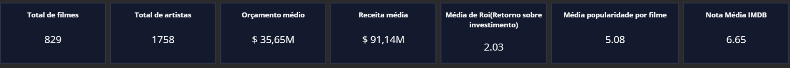
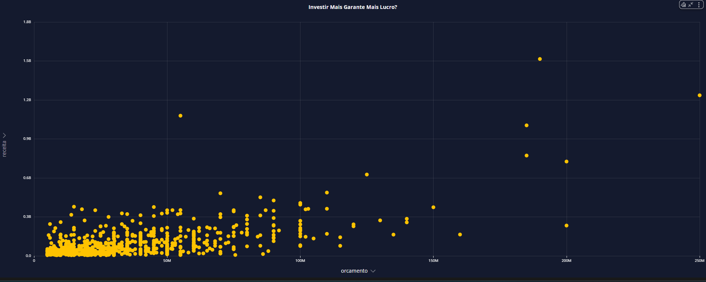
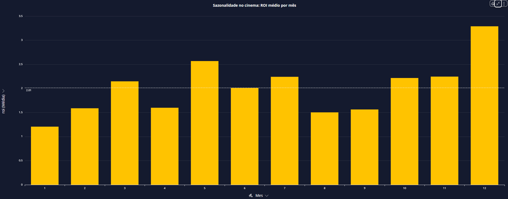

#  Projeto de Engenharia de Dados - Filmes & Séries  

##  Visão Geral  
Este projeto implementa um **pipeline de dados em nuvem** utilizando serviços da **AWS** para ingestão, transformação e análise de informações sobre **filmes e séries**.  

A solução integra fontes **on-premise** (arquivos CSV) e **APIs externas** (TMDB), processa os dados em múltiplas camadas no **S3** (Raw, Trusted e Refined), aplica transformações com **AWS Glue (PySpark)** e disponibiliza insights por meio do **AWS QuickSight**.  

 

---

##  Objetivos do Projeto  
- Criar um **pipeline completo** de dados usando boas práticas de Data Lake.  
- Integrar **dados on-premise (CSV)** com **APIs externas (TMDB)**.  
- Organizar os dados em **camadas (Raw, Trusted, Refined)**.  
- Processar e transformar os dados usando **AWS Glue + PySpark**.  
- Consultar e analisar os dados com **Athena**.  
- Disponibilizar insights visuais via **QuickSight**.  

---

##  Estrutura do Data Lake  

- **Raw Layer** → Armazena dados brutos, sem transformação.  
- **Trusted Layer** → Dados limpos e padronizados.  
- **Refined Layer** → Dados modelados e otimizados para análise.  

---

##  Tecnologias Utilizadas  

- **Linguagens & Ferramentas**: Python, PySpark, Docker  
- **Cloud AWS**:  
  - S3 (Raw, Trusted, Refined)  
  - Lambda (ingestão de dados + integração TMDB API)  
  - Glue (ETL e modelagem dimensional)  
  - Athena (consultas SQL sobre dados no S3)  
  - QuickSight (dashboards interativos)  
  - CloudWatch (monitoramento e logs)

---

##  Pipeline de Dados  

###  **Step I - On-premise Sources**  
- Base de **Filmes (164 MB)** e **Séries (74 MB)** em CSV.  
- Pré-processamento com **Python + Docker**.  
- Envio dos dados para o **S3 Raw**.  

 

### **Step II - External Sources**  
- Integração com a **TMDB API** para enriquecimento dos dados.  
- Coleta de atributos adicionais: popularidade, orçamento, receita, ROI, etc.

 

###  **Step III - AWS Platform (ETL)**  
- **AWS Lambda**: orquestra o envio e chamadas para APIs.  
- **AWS Glue (PySpark)**:  
  - Criação da **Trusted Layer** com dados limpos. 

###  **Step IV - AWS Platform (ETL)** 
  - Criação da **Refined Layer** com modelo dimensional.

###  **Step V - Analytics & Dashboards**  
- **AWS Glue Data Catalog**: catálogo de tabelas.  
- **Athena**: consultas SQL sobre o Data Lake.  
- **QuickSight**: dashboards para análise de ROI, notas, popularidade e tendências.

---

##  Modelagem Dimensional  

Na camada **Refined**, os dados foram organizados em modelo dimensional:  

- **Fato**: `fato_desempenho_filmes`  
- **Dimensões**:  
  - `dim_filme`  
  - `dim_artista`  
  - `dim_data` 

 

---

##  Análises Realizadas

##  Resultado Final

###  Paleta de Cores

###  Cabeçalho

#### **O Que Define o Sucesso no Cinema?**  
**Uma Análise de ROI, Receita e Popularidade**

---

###  KPIs Principais

- **Total de filmes:** `829`  
- **Total de artistas:** `1.758`  
- **Orçamento médio:** `US$ 35,65M`  
- **Receita média:** `US$ 91,14M`  
- **ROI médio:** `2,03`  
- **Popularidade média:** `5,08`  
- **Nota IMDb média:** `6,65`  

---

### 1️ ROI dos Filmes
  

---

### 2️ Relação entre Nota, Popularidade e ROI

---

### 3️ Orçamento vs Receita

---

### 4️ Evolução ao Longo dos Anos

---

### 5️ ROI por Década

---

### 6️ Sazonalidade dos Lançamentos

---

### 7️ Artistas de Alto Desempenho
  

---

##  Conclusão

- A indústria cinematográfica se tornou **mais cara** e **menos eficiente** financeiramente ao longo do tempo.  
- Histórias bem construídas e **investimentos enxutos** ainda se provam extremamente lucrativos.  
- O sucesso é multifatorial: **nota crítica, popularidade, marketing, timing e apelo cultural**.  
- **Artistas estratégicos** e **datas de lançamento certas** continuam sendo peças-chave para o ROI.  

---