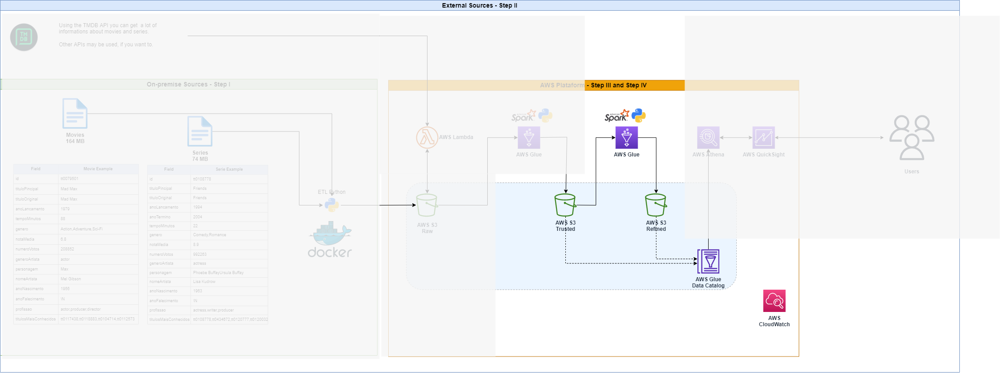
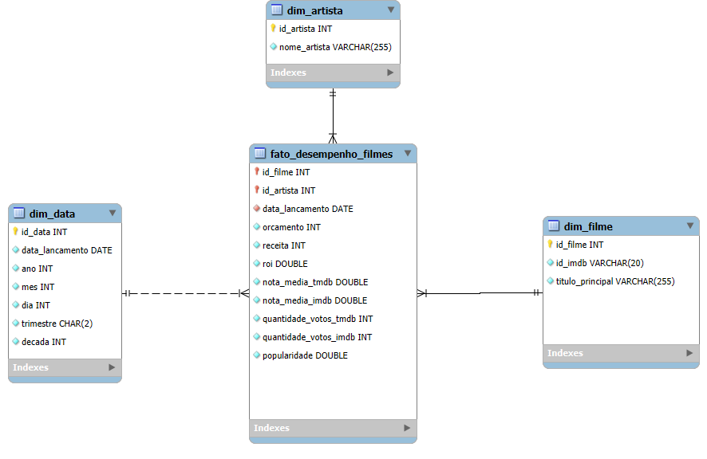

# Step IV – AWS Platform (ETL)

##  Objetivo
Esta etapa tem como objetivo consolidar e transformar os dados provenientes do **IMDb** e do **TMDB**, aplicando filtros de qualidade, cálculos de métricas e enriquecimento, para gerar um **modelo dimensional** no formato **Parquet** dentro da camada **Refined** no **Amazon S3**.  
O resultado é um **Data Warehouse em estrela** composto por uma **tabela fato** e **três dimensões** (filme, artista e data), que servirão como base para análises no **Amazon Athena** e visualizações no **Amazon QuickSight**.

---

##  Fluxo da Solução
1. **Entrada**
   - IMDb (Trusted/Local/Parquet)
   - TMDB (Trusted/TMDB/Parquet)

2. **Processamento**
   - Filtros de qualidade (valores > 0, datas ≥ 1970, percentil 20%)
   - Cálculo de ROI
   - Join entre IMDb e TMDB pelo campo `imdb_id`
   - Padronização de colunas

3. **Saída**
    As tabelas resultantes são salvas no S3, em formato Parquet:
   - s3://<bucket>/Refined/
        - `fato_desempenho_filmes/`
        - `dim_data/`
        - `dim_artista/`
        - `dim_filmes/`

---

##  Modelo Dimensional

- **dim_filme**: informações básicas de identificação de filmes.  
- **dim_artista**: nomes dos artistas ligados aos filmes.  
- **dim_data**: datas de lançamento enriquecidas com hierarquia temporal (ano, mês, trimestre, década).  
- **fato_desempenho_filmes**: métricas principais de orçamento, receita, ROI, notas e popularidade.  

##  Execução do Job (Glue)

Parâmetros recebidos pelo script:
- `--JOB_NAME` → Nome do Job no Glue.  
- `--LOCAL_INPUT_PATH` → Caminho IMDb (Parquet Trusted).  
- `--TMDB_INPUT_PATH` → Caminho TMDB (Parquet Trusted).  
- `--S3_TARGET_PATH` → Caminho de saída Refined.  

##  Tecnologias Utilizadas

- **AWS Glue (Spark)**
- **Apache Spark (PySpark)**
- **Amazon S3**
- **AWS CloudWatch Logs**
- **AWS IAM**
- **Amazon Athena** (consulta)
- **Amazon QuickSight** (dashboards)

---

##  Conclusão

A **Step IV** entrega um modelo dimensional confiável e analítico, que consolida métricas financeiras, popularidade e notas de filmes, permitindo análises como:

- ROI por década e gênero  
- Correlação entre orçamento, receita e popularidade  
- Desempenho de artistas ao longo do tempo  

Esse modelo serve como base sólida para relatórios estratégicos e dashboards de BI.

