# Step V – Consumo (Dashboard no Amazon QuickSight)

##  Objetivo
Transformar os dados processados na **camada Refined** em insights visuais por meio de um **dashboard interativo no Amazon QuickSight**, respondendo às principais perguntas de negócio sobre **ROI, receita, popularidade e desempenho de artistas** no cinema.

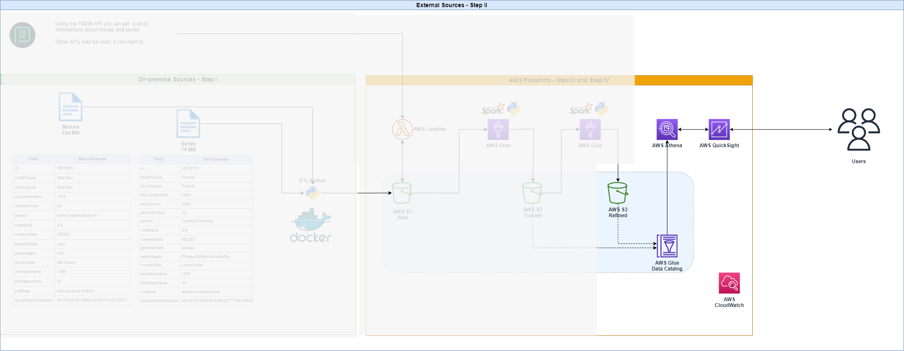

---

##  Perguntas de Negócio Respondidas
1. Qual foi o Retorno sobre Orçamento (ROI) dos filmes?
**Objetivo:** Avaliar a eficiência financeira dos filmes, identificando os títulos com maior retorno proporcional em relação ao investimento feito. 
     
2. Existe uma relação entre avaliação crítica, popularidade e retorno financeiro dos filmes?
**Objetivo:** Analisar se filmes com nota média mais alta (IMDB), maior popularidade e de diferentes décadas tendem a apresentar ROI mais elevado — identificando se o sucesso crítico está alinhado com sucesso comercial e engajamento do público.  
  
3. Os filmes com maior orçamento realmente geram maior receita?
**Objetivo:** Observar a relação entre o valor investido (orçamento) e a arrecadação bruta (receita), validando se altos investimentos garantem alta rentabilidade.  

4. Como orçamento e receita evoluíram ao longo dos anos?
**Objetivo:** Visualizar a tendência temporal de **investimento** e **faturamento** da indústria ao longo do tempo, revelando padrões históricos e momentos de crescimento ou retração   

5. Como a rentabilidade dos filmes se comportou ao longo das décadas?
**Objetivo:** Observar a média de ROI por década, identificando períodos mais lucrativos para o setor cinematográfico   

6. Existe uma sazonalidade nos lançamentos mais lucrativos?
**Objetivo:** Verificar se há meses com **ROI médio mais elevado**, indicando melhores épocas para lançamento de filmes com foco em rentabilidade.   

7. Quais artistas combinam recorrência no mercado com alto desempenho?
**Objetivo:** Descobrir artistas com presença frequente (nº de filmes) que também entregam bom ROI e popularidade — destacando nomes estratégicos para produções financeiramente eficazes. 

---

## Tecnologias Utilizadas

- Amazon S3   
- Amazon Athena (conector dos dados Refined com o QuickSight)  
- Amazon QuickSight (ferramenta de visualização)

--- 

###  Paleta de Cores
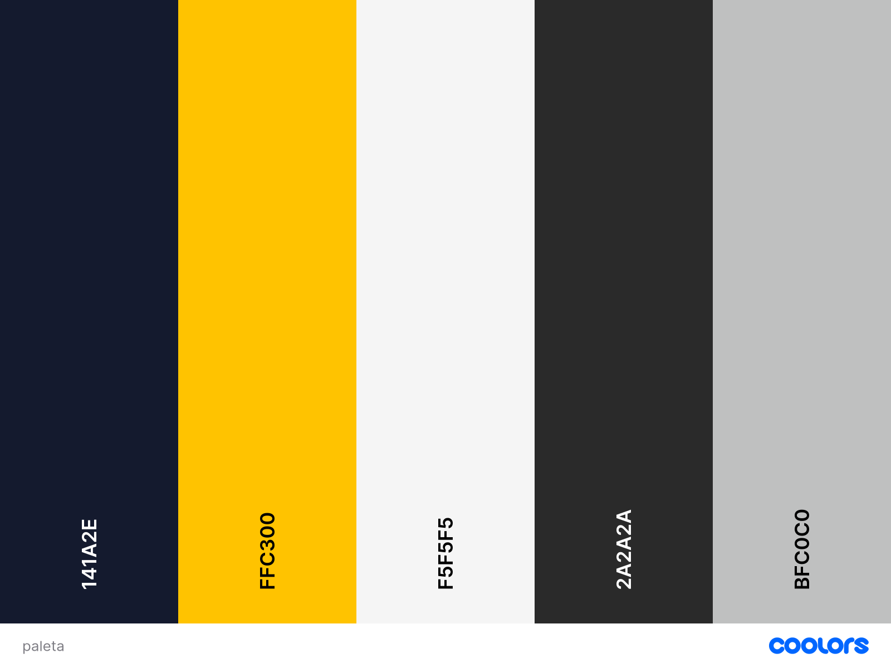

###  Cabeçalho

#### **O Que Define o Sucesso no Cinema?**  
**Uma Análise de ROI, Receita e Popularidade**

---

###  KPIs Principais
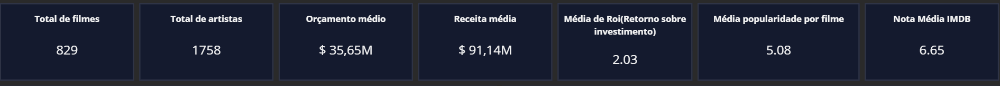

- **Total de filmes:** `829`  
  A base é composta por 829 filmes, garantindo diversidade e robustez estatística.  

- **Total de artistas:** `1.758`  
  Representa a diversidade de atores, atrizes e profissionais envolvidos.  

- **Orçamento médio:** `US$ 35,65M`  
  Valor médio elevado, mas que esconde contrastes entre produções modestas e blockbusters.  

- **Receita média:** `US$ 91,14M`  
  Mostra que, em média, os filmes arrecadam mais que o triplo do investimento.  

- **ROI médio:** `2,03`  
  Cada US$ 1 investido gera em média US$ 2,03 de retorno.  

- **Popularidade média:** `5,08`  

- **Nota IMDb média:** `6,65`   

---

### 1️ - ROI dos Filmes
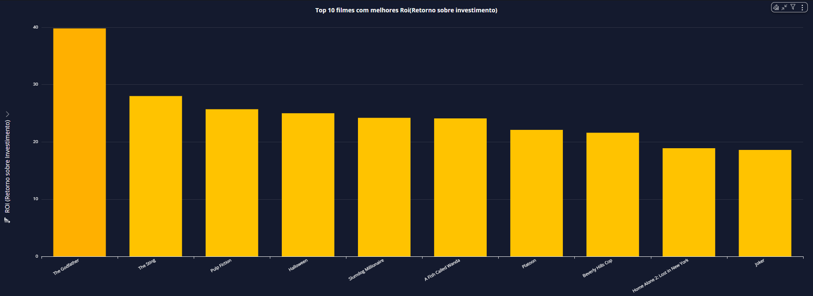  
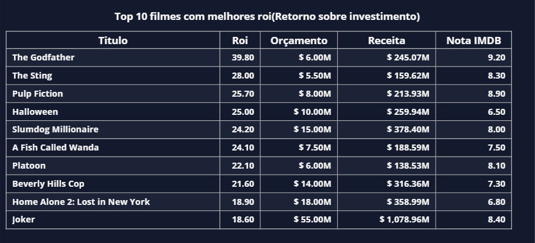

Clássicos como *The Godfather* e *Pulp Fiction* multiplicaram seus investimentos mais de 25 vezes.  
*Halloween* surpreendeu com ROI altíssimo apesar de nota IMDb baixa.  
*Joker* provou que altos investimentos também podem gerar grande retorno, ultrapassando US$ 1 bilhão de receita.

---

### 2️ - Relação entre Nota, Popularidade e ROI
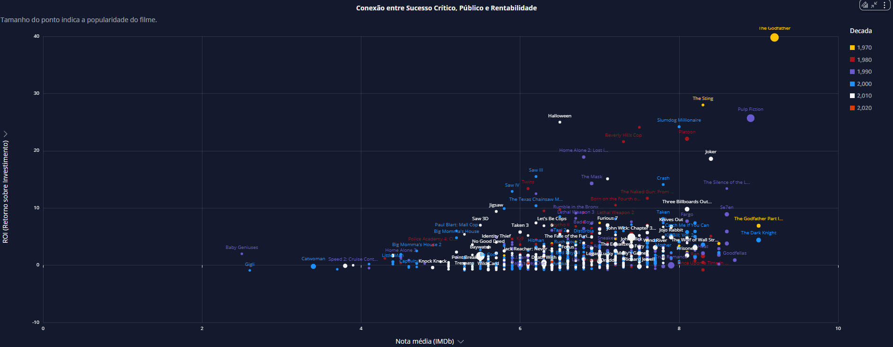

O sucesso não depende de um único fator.  
- *The Godfather* e *Joker* → **bem avaliados, populares e rentáveis**.  
- *Baywatch* → **popularidade alta, mas prejuízo financeiro**.  
- *True Romance* → **nota boa, popularidade razoável, mas sem retorno**.  

Décadas de 70 e 80 aparecem como **era de ouro do ROI**, com produções enxutas e eficientes.

---

### 3️ - Orçamento vs Receita
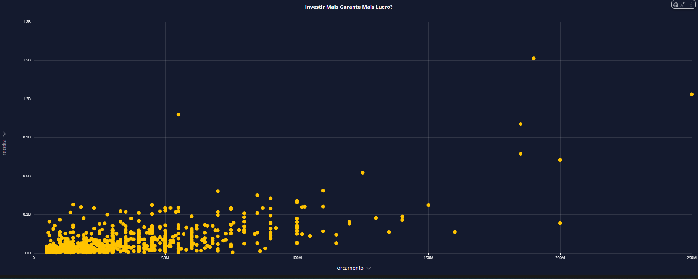

Filmes com altos orçamentos tendem a gerar mais receita, mas não há garantia.  
Diversos títulos caros fracassaram, enquanto filmes modestos alcançaram grande rentabilidade.

---

### 4️ - Evolução ao Longo dos Anos
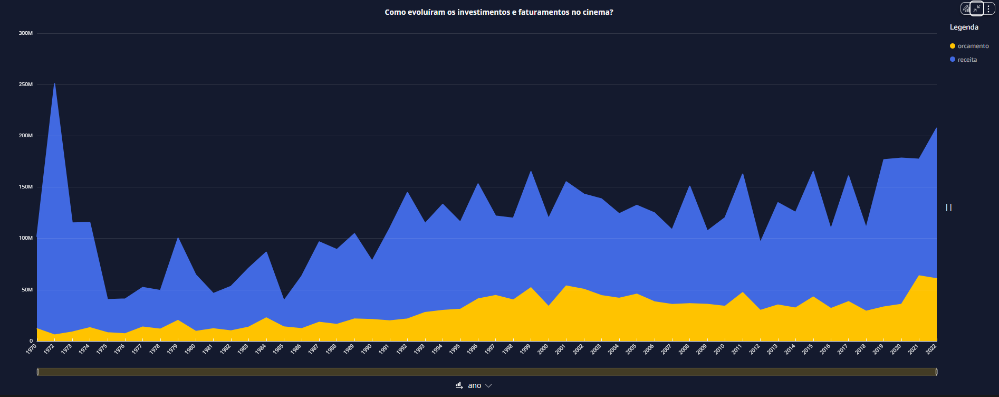

Tanto o orçamento quanto a receita cresceram ao longo das décadas.  
Porém, os custos sobem em ritmo maior que as receitas, reduzindo margens de lucro — especialmente nos anos 2010.

---

### 5️ - ROI por Década
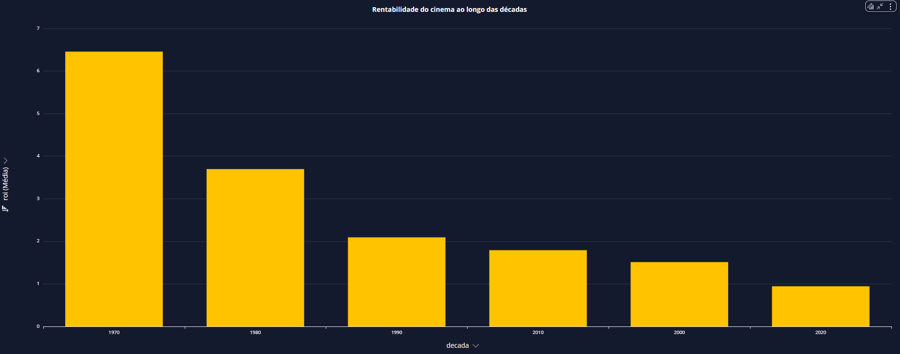

O ROI médio caiu fortemente ao longo das décadas.  
- 1970 → ROI médio acima de 6.  
- 2020 → ROI abaixo de 1.  

Isso mostra que o aumento dos custos superou o crescimento dos lucros.

---

### 6️ - Sazonalidade dos Lançamentos
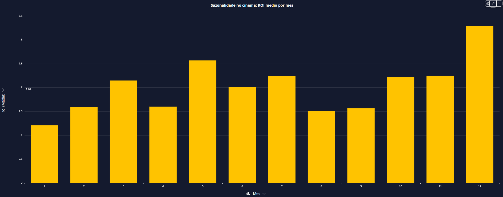

Meses de **maio, julho, novembro e dezembro** concentram ROI mais alto (férias e feriados).  
Meses como **janeiro, abril e agosto** têm desempenho abaixo da média.

---

### 7️ - Artistas de Alto Desempenho
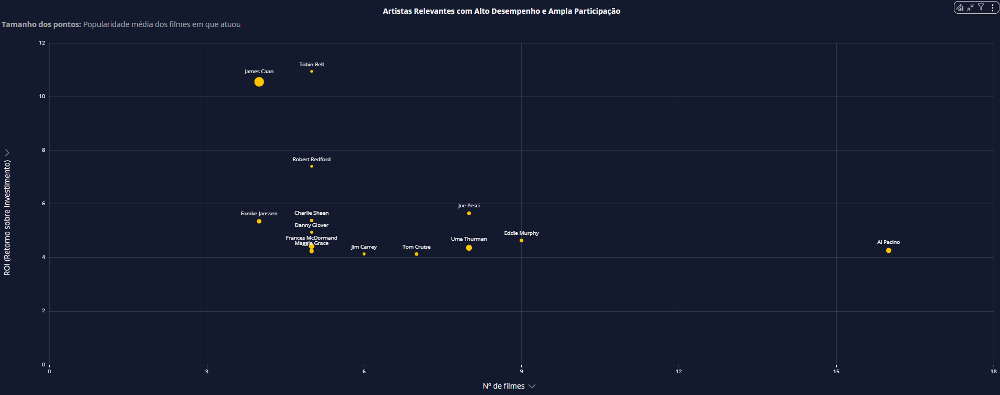  
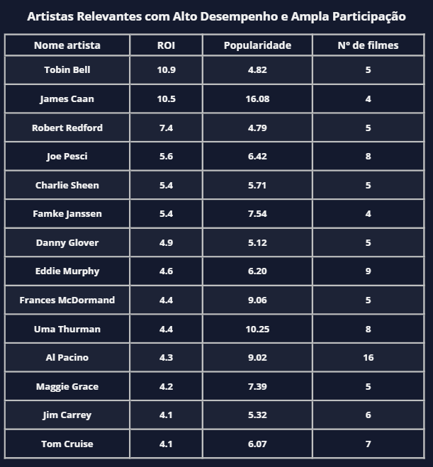

- **Altos ROI:** Tobin Bell, James Caan e Robert Redford.  
- **Recorrentes e rentáveis:** Al Pacino e Eddie Murphy.  
- **Mais populares:** Uma Thurman, James Caan e Frances McDormand.  

Esses nomes se destacam tanto pela **rentabilidade** quanto pela **ampla participação no mercado**.  
---

##  Conclusão

- A indústria cinematográfica se tornou **mais cara** e **menos eficiente** financeiramente ao longo do tempo.  
- Histórias bem construídas e **investimentos enxutos** ainda se provam extremamente lucrativos.  
- O sucesso é multifatorial: **nota crítica, popularidade, marketing, timing e apelo cultural**.  
- **Artistas estratégicos** e **datas de lançamento certas** continuam sendo peças-chave para o ROI.